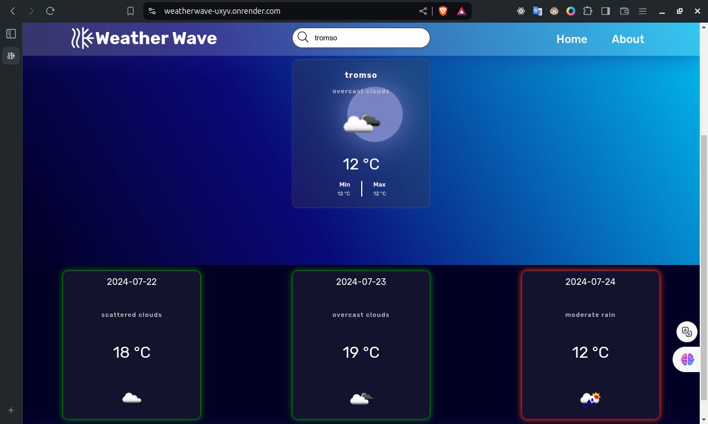

```markdown
# Weather Wave

Welcome to **Weather Wave**, your go-to app for accurate and up-to-date weather forecasts. Our mission is to provide you with reliable weather information so you can plan your day with confidence. Whether you're preparing for a weekend getaway or just need to know if you need an umbrella today, Weather Wave has got you covered.
if 

## Live Demo

Check out the live demo of the website [here](https://weatherwave-uxyv.onrender.com/).
**sometimes the page take 50s**
## Features

- **Current Weather**: Get the current weather information for any city.
- **3-Day Forecast**: See the weather forecast for the next 3 days.
- **Dynamic Content Loading**: Navigate between pages without refreshing the browser.
- **Responsive Design**: Optimized for both desktop and mobile devices.
- **Weather Indicators**: Forecast cards with green and red flashing borders to indicate stable and fluctuating weather conditions.

## Weather Indicators

- **Green Border**: Indicates stable weather conditions such as clear sky, few clouds, scattered clouds, and broken clouds. The green border flashes to draw attention to favorable weather conditions.
- **Red Border**: Indicates fluctuating weather conditions such as shower rain, rain, thunderstorm, snow, and mist. The red border flashes to highlight potential weather disruptions.

## Screenshots


*Home page showing current weather and 3-day forecast.*

*Forecast cards with green and red flashing borders.*

*About Weather Wave*


## Technologies Used

- **Frontend**: HTML, CSS, JavaScript, jQuery
- **Backend**: Python, Flask
- **API**: OpenWeatherMap API for fetching weather data

## Installation

1. Clone the repository:
   ```bash
   git clone https://github.com/your-username/weather-wave.git
   cd weather-wave
   ```

2. Create and activate a virtual environment:
   ```bash
   python3 -m venv venv
   source venv/bin/activate   # On Windows use `venv\Scripts\activate`
   ```

3. Install the required dependencies:
   ```bash
   pip install -r requirements.txt
   ```

4. Run the Flask application:
   ```bash
   python app.py
   ```

5. Open your browser and go to `http://127.0.0.1:5000/` to see the app in action.

## Usage

- **Home Page**: Enter the city name to get the current weather and 3-day forecast.
- **About Page**: Learn more about the Weather Wave project.

## Contributing

Contributions are welcome! Please open an issue or submit a pull request for any improvements or new features.

## License

This project is licensed under the MIT License. See the [LICENSE](LICENSE) file for details.

## Acknowledgements

- Thanks to [OpenWeatherMap](https://openweathermap.org/) for providing the weather data API.
